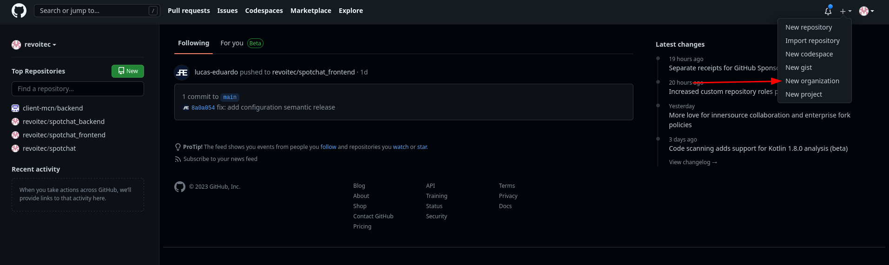
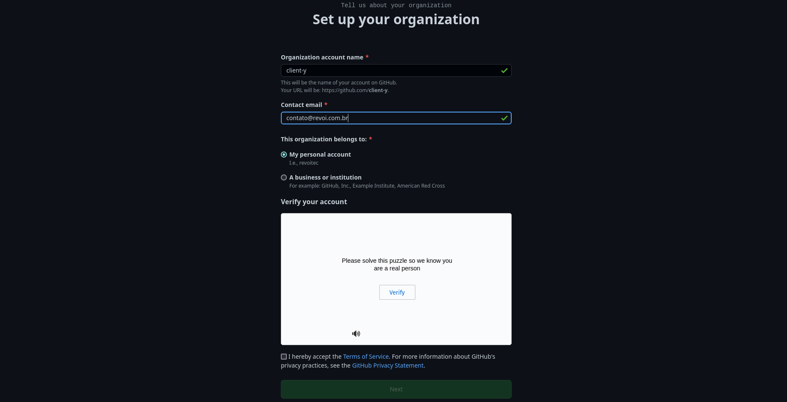
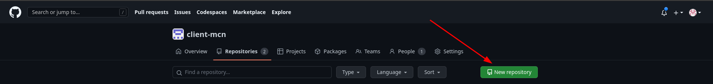
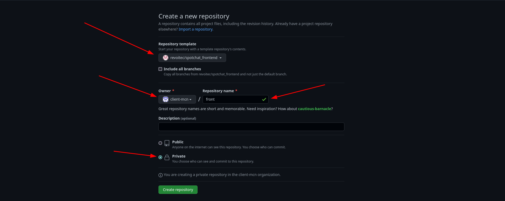
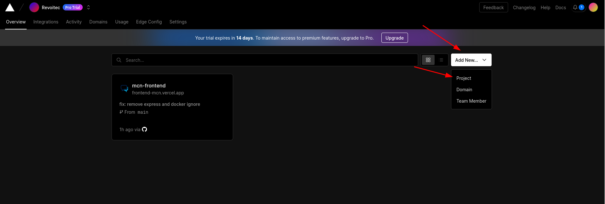
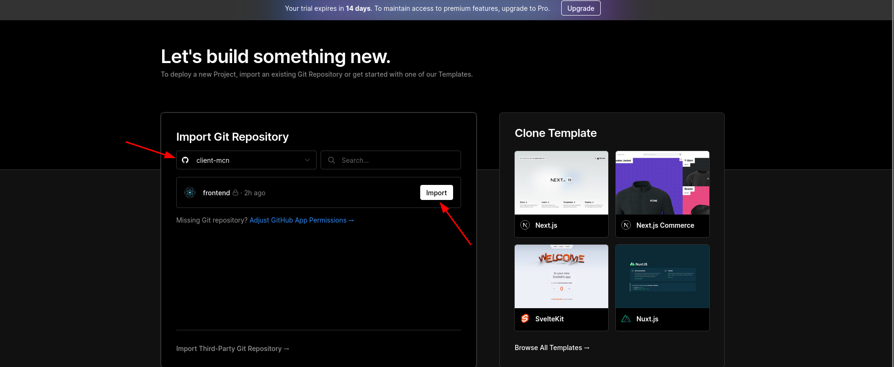
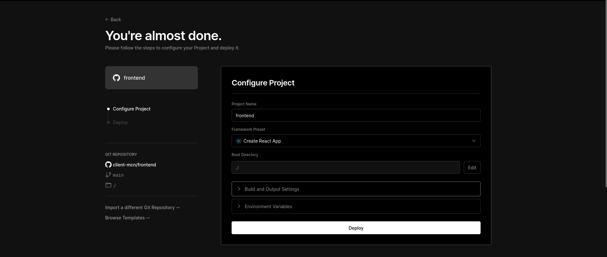
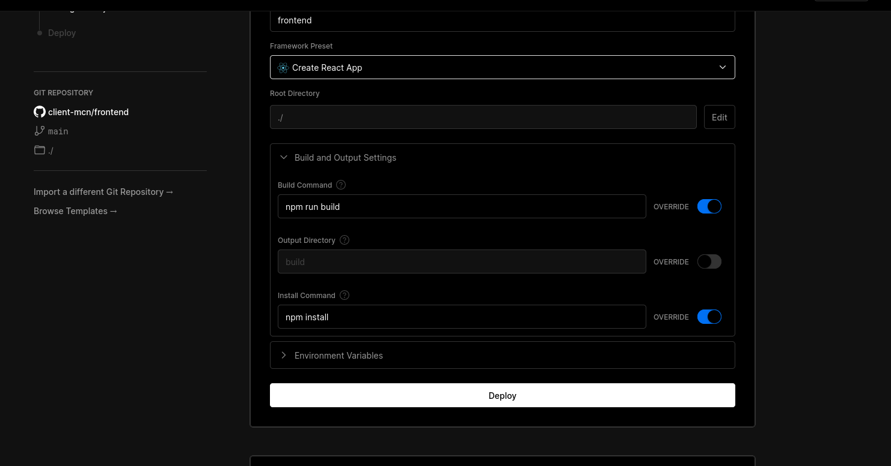
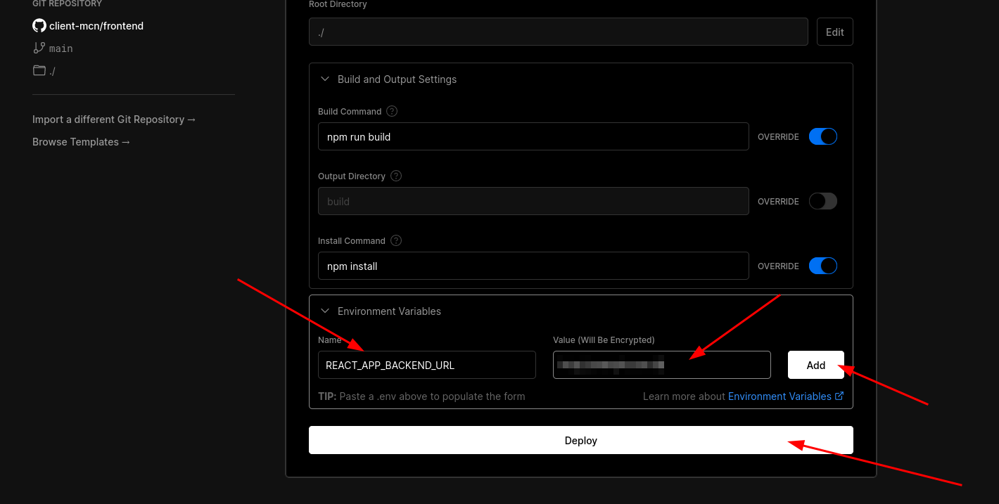
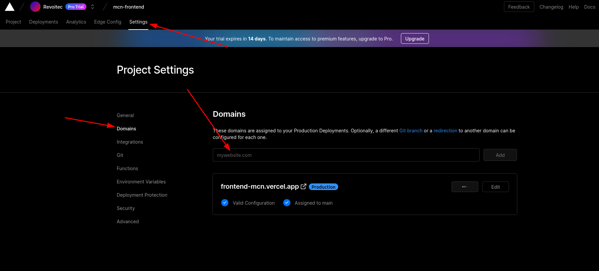

# SACMAIS Frontend

>- Passo a passo de como subir a aplicação do frontend.

>- Cada cliente terá uma configuração no railway, vercel e supabase.

---

## Plataformas utilizadas:

- [Vercel][vercel]
- [Railway][railway]
- [Supabase][supabase]

---

## Iniciando para um novo cliente

### 1. Criar uma nova organização no github

É preciso criar uma nova organização no github para que as plataformas realizem o deploy da aplicação e tudo fique bem separado. Uma vez que a organização foi criada, é nela que estrá presente o backend e o frontend.

### 2. Criar o repositório do frontend usando o repositório template

Ao usar o repositório template, o mesmo já virá tudo configurado.

### 3. Criar o projeto na Vercel

É necessário criaro projeto separado na vercel.

Selecione a organização e o repositório do frontend criado

Defina o nome do projeto

Configure o build

Defina a variavel de ambiente e depois só realizar o deploy

A própria vercel irá gerar um link, mas caso queira ter o próprio dominio, só fazer a configuração:

[vercel]: https://vercel.com
[railway]: https://railway.app
[supabase]: https://app.supabase.com
